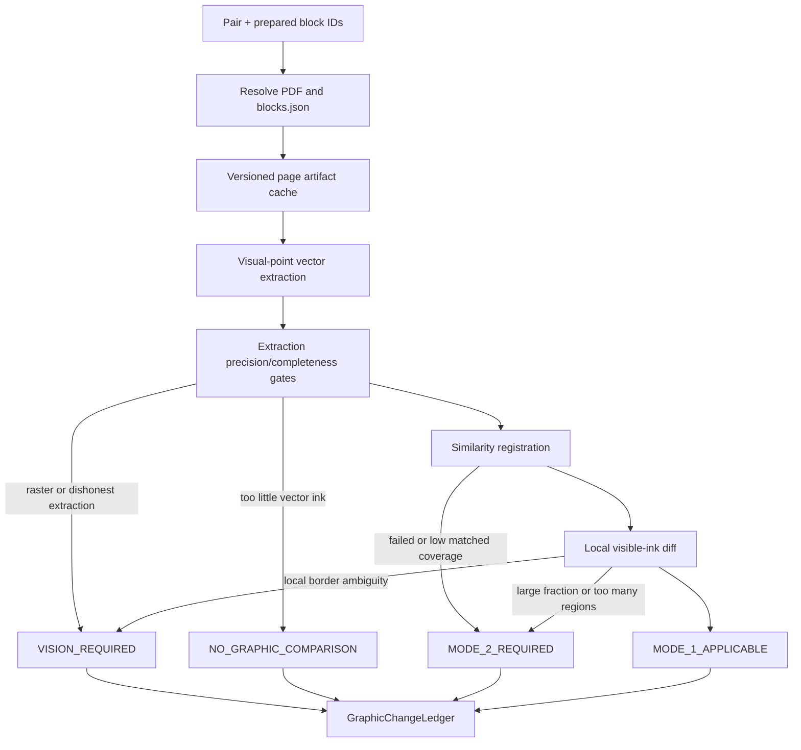

# Production Graphic Comparison G1

G1 сравнивает только уже подготовленные upstream графические блоки. Он вводит
единый router, production Mode 1 (`registration + local vector diff`) и общий
`GraphicChangeLedger`. Структурный Mode 2 здесь намеренно отсутствует: маршрут
`MODE_2_REQUIRED` сохраняется без попытки вызвать research EOM parser или
опубликовать локальные изменения.

## Реальный входной контракт

HTTP-вход принимает только ссылки на существующие блоки:

```json
{
  "left_block_ids": ["block-left-17"],
  "right_block_ids": ["block-right-22"]
}
```

Backend разрешает каждый ID строго в `02_work/blocks.json` соответствующего
документа пары и использует текущий PDF из pair metadata. Inline bbox,
polygon, page или URL в запросе задать нельзя. Неизвестный либо повторённый ID
останавливает запрос. Массивы являются частью контракта, но G1 исполняет только
`1 ↔ 1`; иной cardinality получает `MODE_2_REQUIRED`.

Используемые поля реального `blocks.json`:

- `block_id` — upstream identity;
- `page_index` — нулевой индекс страницы; legacy page label только читается
  как fallback;
- `block_type` — владелец pipeline;
- `coords_norm` — upstream bbox `[x0, y0, x1, y1]` в нормированной визуальной
  системе страницы с началом слева сверху;
- `polygon_points` / `polygon_norm` — опциональная upstream граница;
- `ocr_label` / `label` / `title` — только адресная подсказка.

`crop_url` остаётся свойством upstream/UI. G1 не создаёт второй URL и не
копирует тяжёлые изображения в ledger. Source provenance содержит имя
artifact, coordinate space и SHA-256 PDF.

Текстовые, табличные и штамповые блоки получают
`NO_GRAPHIC_COMPARISON/GRAPHIC_NOT_APPLICABLE`. G1 не меняет и не вызывает
Stage 2–5, не публикует текстовые расхождения и использует PDF text spans
только как консервативную маску и `ADDRESS_ONLY` hint.

## Архитектура и маршрутизация



Router всегда возвращает один из четырёх маршрутов:

- `MODE_1_APPLICABLE` — регистрация доказана, изменение локально либо
  publishable-регионов нет;
- `MODE_2_REQUIRED` — структурная перестройка, many-to-many, провал
  регистрации, низкое matched coverage, слишком большая доля изменения или
  слишком много локальных регионов; `changes` обязательно пуст;
- `VISION_REQUIRED` — векторное доказательство нечестно из-за растра,
  неполноты/лишней геометрии, асимметричного текста-кривых либо изолированной
  локальной неопределённости;
- `NO_GRAPHIC_COMPARISON` — графика не применима, одна сторона пуста или
  векторного ink недостаточно.

Whole-block Vision в G1 не вызывается. Для уже изолированного
`UNCERTAIN_GRAPHIC_CHANGE` ledger создаёт только targeted request: два
локальных bbox, region/change IDs, конкретный вопрос и запрет Vision создавать
новые векторные координаты. Для raster-backed блока фиксируется необходимость
иного comparator, но глобальный запрос не подменяется локальным.

## Извлечение и координаты

`PageArtifactCache` ключуется как
`(pdf_sha256, page_index, extractor_version)`. Документ и
`page.get_drawings(extended=True)` разбираются один раз на страницу в процессе;
повторные block crops используют общий flattened page artifact. Cache
версионирован, не зависит от bbox и ограничен восемью LRU page artifacts на
процесс, чтобы плотные CAD-листы не накапливались без границы.

Извлечение работает в физических PDF points:

- upstream bbox/polygon переводится через фактический visual `page.rect`;
- drawing/text geometry проходит через `page.rotation_matrix`, поэтому
  `/Rotate 90/180/270` не создаёт вторую систему координат;
- независимое растягивание `x/w` и `y/h` запрещено;
- page flatten не использует ненадёжный `drawing.rect` как gate;
- horizontal, vertical и degenerate stroked paths не теряются;
- stroke clipping учитывает scissor и clip paths, fill — clipping и even-odd;
- белая либо прозрачная paint geometry удаляется до сравнения;
- подготовленный polygon остаётся финальной границей crop.

Extraction quality отдельно считает precision и completeness относительно
отрендированного PDF, исключая текстовые области, raster images и crop edge.
Gates не смешиваются: низкая completeness не может быть скомпенсирована
precision и наоборот.

## Mode 1

Перед регистрацией последовательные коллинеарные отрезки одного PDF path
сливаются, чтобы разная CAD-packaging не выглядела изменением. Разрешённое
преобразование LEFT → RIGHT ограничено translation, uniform scale и малым
rigid rotation. Non-uniform scale и свободный affine отсутствуют. Малый
rotation принимается только если улучшает matched-ink coverage не менее чем на
зафиксированный policy gain.

Диагностика регистрации сохраняет:

- выбранную гипотезу и полный similarity transform;
- anchor candidates/matches/coverage и translation votes;
- left/right/symmetric ink coverage;
- residual median/p90, confidence и точную failure reason;
- компактный trace проверенных гипотез.

Local diff строится в общем right-frame с физической сеткой. Tolerance и
merge radius определены в points. Из компоненты публикуется только один из
типов:

- `ADDED_GRAPHIC`;
- `REMOVED_GRAPHIC`;
- `GEOMETRY_CHANGED`;
- `UNCERTAIN_GRAPHIC_CHANGE`.

Система не называет объект, не доказывает connectivity и не выводит
семантическое движение. Соседние added/removed части одной деформации могут
быть объединены только в консервативный `GEOMETRY_CHANGED`. Изменение текста
само по себе отбрасывается. Область вне общего crop, исчезнувшая после
source-page border probe, маркируется как crop artifact. Probe является
lookup вокруг upstream bbox и никогда не меняет сам bbox.

Параметры находятся в одном именованном policy
`EXPERIMENTALLY_CALIBRATED_V1`. Ledger сохраняет ID, версию, provenance и все
числовые значения. Пороговые числа не разбросаны по router.

## GraphicChangeLedger

Артефакт пары: `graphic_change_ledger.json`, schema
`graphic-change-ledger.v1`. JSON Schema лежит рядом с runtime validator.

Ledger содержит:

- точный comparison scope обеих сторон и source provenance;
- route, фактически исполненный mode и routing reason;
- versioned policy;
- extraction/registration/diff quality;
- устойчивые comparison/change/region IDs;
- left/right region refs, а также обе координаты общего локального окна даже
  для чистого added/removed;
- vector evidence, address hints, confidence и provenance;
- filtered-region reasons, compact mask summary и targeted Vision requests.

Raw vectors, full-page bitmaps и debug crops в ledger не записываются.
Повторный запуск с теми же PDF, `blocks.json`, IDs и policy детерминированно
возвращает существующий artifact. GET вычисляет `diagnostics.stale` по текущей
source signature; изменение источника во время тяжёлого расчёта запрещает
сохранение.

API:

- `POST .../sessions/{session_id}/pairs/{pair_id}/graphic-comparison` —
  построить либо переиспользовать ledger;
- `GET .../sessions/{session_id}/pairs/{pair_id}/graphic-comparison` — получить
  ledger или `status: not_started`.

Pair view также включает `graphic_change_ledger`. Отдельный UI графических
блоков до G1 в portal отсутствовал, поэтому новый экран и дублирующий просмотр
не добавлялись.

## Что перенесено, переписано и не использовано

Из research `b37e9f20` перенесены доказанные идеи: physical-point grid,
collinear packaging normalization, descriptor/vote registration,
matched-ink gates, local component diff, text/crop filters и калиброванный
policy. Реализация переписана под production `blocks.json`, pair storage,
runtime validation, page cache, source signatures и API.

Переиспользованы PyMuPDF visual coordinate semantics, существующий Stage
Comparison store/paths, атомарная запись JSON, pair source metadata и
prepared `02_work/blocks.json`.

Не перенесены research-only benchmark runner, EOM parser, detector/segmentation,
новые primary bbox, affine/non-uniform alignment, object reconstruction,
global Vision, второй text/table pass и тяжёлые debug artifacts. Скрипт
`scripts/benchmark_graphic_comparison_g1.py` является только воспроизводимым
production regression runner и не участвует в API.

## Проверка и ограничения G1

Unit/integration набор покрывает 32 сценария, включая обязательные 20 классов:
same/add/remove/geometry, малое изменение в большом блоке, packaging,
0.5/2/10% boundary drift, crop artifact, text-only, исключение
text/table/stamp, `/Rotate`, horizontal/vertical/degenerate paths, white fill,
registration failure, structural redesign, raster routing, schema,
determinism/cache, multi-block/empty, clip/even-odd и реальный session API.

Воспроизводимый production regression на `benchmark_pairs.json` из research
commit `b37e9f20` (56 реальных пар) дал:

- routes: `MODE_1_APPLICABLE=40`, `MODE_2_REQUIRED=10`,
  `VISION_REQUIRED=6`;
- Mode 1 pair-level: `TP=9, FP=0, FN=0, TN=31`;
- region recall при исходном cutoff `text_share < 0.5`: `40/42 = 0.9524`;
- строгий срез `text_share < 0.3`: `34/34 = 1.0`;
- routing agreement: `47/51` без пяти degenerate fixtures;
- major redesigns, ошибочно оставшиеся в Mode 1: `0`;
- четыре repack negative controls: `0` пар с опубликованными изменениями;
- среди 40 допущенных Mode 1 пар extraction precision минимум `0.9808`,
  recall минимум `0.9914`; по всему корпусу минимум precision `0.8456`
  безопасно остался за quality gate, минимум recall составил `0.9848`;
- все исполняемые baseline assertions прошли.

Отдельный strong P→RD GRSh из research commit
`615433fd8e4e01e9ea5b4442fffe3632bfd80bdb` получил
`MODE_2_REQUIRED/REGISTRATION_FAILED`, symmetric coverage `0.13846` и
`changes=0`. Следовательно, сильная структурная перестройка не маскируется
локальным Mode 1.

Прогон выполнялся восемью cold processes: per-pair elapsed median `5.886 s`,
p90 `68.691 s`, max `367.691 s`; strong GRSh `18.633 s`. Эти значения включают
CPU/memory contention и отдельный page cache каждого процесса. Они являются
stress-regression timings, а не обещанием одиночной request latency. На
последовательном контрольном замере две плотные EOM-пары занимали примерно
`11 s` каждая после spatial-index/cache оптимизации.

Ограничения этапа:

- Mode 2 не реализован и не симулируется;
- G1 не сопоставляет many-to-many и не ищет блоки;
- raster-backed scope требует отдельного будущего comparator;
- targeted Vision здесь является контрактом запроса, не model call;
- text-as-curves может консервативно направить пару в Vision;
- benchmark thresholds были откалиброваны и оценены на одном 56-парном
  корпусе с одним разметчиком; это не независимая внешняя валидация;
- page cache process-local и не является межпроцессным persistent cache.
